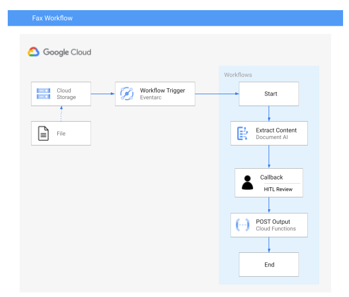

# Prerequisites
1. Enable the Document AI API for your project: `gcloud services enable documentai.googleapis.com`
1. For Document AI you must [create a Document OCR processor](https://cloud.google.com/document-ai/docs/create-processor#create-processor) via the Google Cloud Console. This operation is currently only support in the Google Cloud Console. After creation note the processor id to be provided as a variable to Terraform.
1. Set `docai_processor_id` with the id of your processor

# Provisioning
1. `terraform init`
1. `terraform plan`
1. `terraform apply`

# Usage
***Although your trigger is created immediately, it can take up to 10 minutes for a trigger to propagate and filter events.***

Trigger the workflow by uploading a file to the ingest bucket
```
gsutil cp MY_FILE.pdf gs://${PROJECT_ID}-fax-workflow-ingest
```

Monitor the workflow logs for the callback URL
```
curl -X GET -H "Authorization: Bearer $(gcloud auth print-access-token)" CALLBACK_URL
```

# Cleanup
1. Disable the OCR processor.
1. `terraform destroy`

# Architecture
